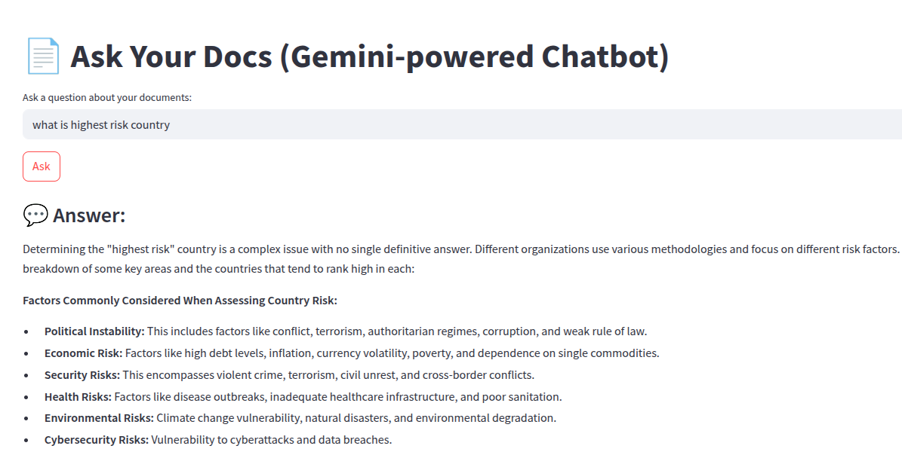
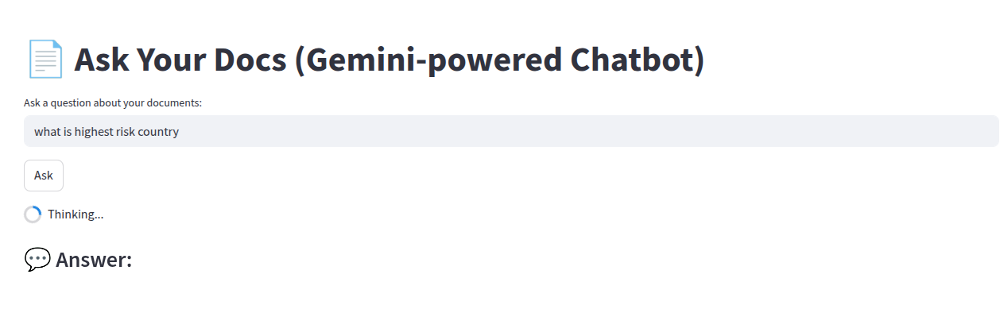

# 🧠 DocBot AI

A professional-grade, private chatbot that answers questions based on your own documents using retrieval-augmented generation (RAG) and Google Gemini. Built with FastAPI, ChromaDB, Sentence Transformers, and clean architecture.

---

## 🚀 Features

- 🔍 Intelligent search over private documents (PDF, CSV, TXT)
- 🧩 Chunking & semantic embedding with SentenceTransformers
- 💬 Real-time QA using Gemini API
- 📚 Modular, clean architecture 
- 🐳 Dockerized and cloud-deployable (AWS, Azure, Render)
- 📈 Extendable with authentication, CI/CD, or frontends (Streamlit/React)

---

## 🧱 Architecture Overview

```bash
User Query
↓
Vector Embedding (local)
↓
Vector Search (ChromaDB)
↓
Top-k Relevant Chunks
↓
Prompt Builder
↓
LLM Query (Google Gemini API)
↓
AI Response
```
---

✅ Project Structure
```bash
docbot-ai/
├── app/                 # FastAPI backend
├── core/                # Embedding & LLM wrappers
├── data_ingestion/      # PDF/CSV loader + chunker
├── scripts/             # CLI tools (e.g., ingest)
├── tests/               # Unit tests
├── ui/                  # Streamlit UI
├── Dockerfile
├── Makefile
├── requirements.txt
├── .env.
└── README.md
```
## 🛠️ Tech Stack

| Area              | Tool / Library                        |
|------------------|----------------------------------------|
| API Backend       | FastAPI                                |
| Embeddings        | `sentence-transformers` (MiniLM)       |
| Vector Database   | ChromaDB (local DuckDB+Parquet)        |
| Language Model    | Google Gemini API                      |
| Document Splitter | LangChain `RecursiveTextSplitter`      |
| UI (optional)     | Streamlit                              |
| DevOps            | Docker, Makefile, GitHub Actions       |

## ⚙️ Getting Started

## 📦 Tech Stack

- Python, FastAPI, Streamlit
- Google Gemini API
- ChromaDB + SentenceTransformers
- Docker + Render support


### 1. Clone & Install

```bash
git clone https://github.com/yourusername/docbot-ai.git
cd docbot-ai
python -m venv .venv && source .venv/bin/activate
pip install -r requirements.txt
```

### 2. Configure Environment Variables
Copy `.env.example` and update your Gemini API key:
```bash
GEMINI_API_KEY=AIzaSyXXXXXX...
CHROMA_DB_PATH=./db
```
### 3. Ingest Your Documents
Place raw files into `data/`

### 4. Chunk, Embed, and Store to ChromaDB

This builds the semantic vector store:

```bash
python scripts.ingest_documents
```
🔹 Chunks your documents

🔹 Creates sentence embeddings

🔹 Saves vectors to ChromaDB (/db folder)

### 5. Start the FastAPI Chat Server

```bash
uvicorn app.main:app --reload
```

### 6. Visit `localhost:8000` for Swagger UI

```bash
http://127.0.0.1:8000/docs
```

### 6. (Optional) Run Streamlit Chat UI

If you're using the built-in frontend:

```bash
streamlit run ui/streamlit_app.py
```

🧪 API Usage
POST `/chat`
Headers: `Content-Type: application/json`

```json
{
  "query": "What are the high risk countries?"
}
```

Response:
```json
{
  "answer": "The following countries are labeled as high risk: American Samoa, Anguilla, Bahamas (The), Barbados, Bonaire, Bosnia and Herzegovina, Bouvet Islands, British Indian Ocean Territory, British Virgin Islands, Brunei Darussalam, Bulgaria, Bermuda, Cameroon, Cayman Islands, Costa Rica, Croatia, Curacao, Fiji, Gibralatar, Guam, Guinea, Jamaica, Jersey (Channel Islands), Jordan, Macao SAR, Maldives (The Republic of), Marshall Islands, Mayotte, Micronesia (Fed. Sts.)"
}
```

## 💬 Sample Chat UI

Below is a preview of the Streamlit UI for asking questions from your own documents using Gemini:


### ▶️ Example 1: Loading State



### 🔄 Example 2: Answer State



---


